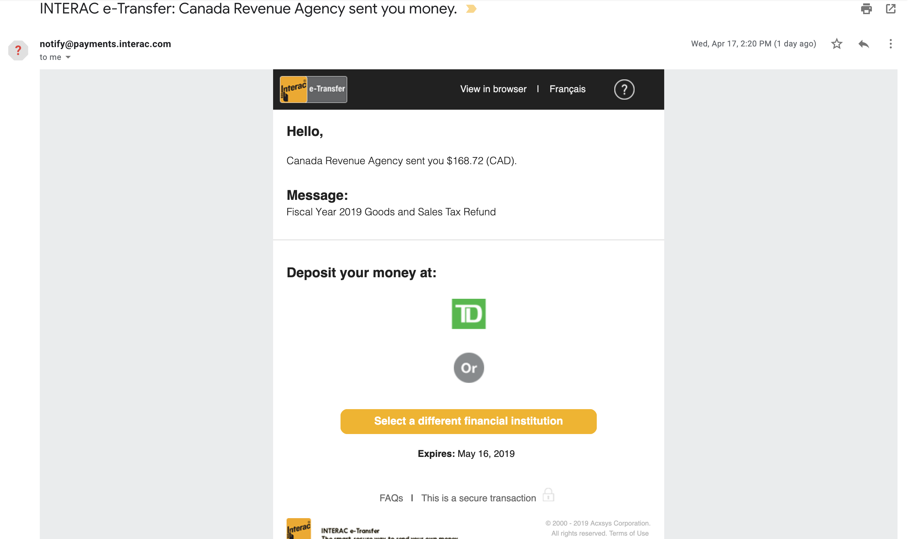
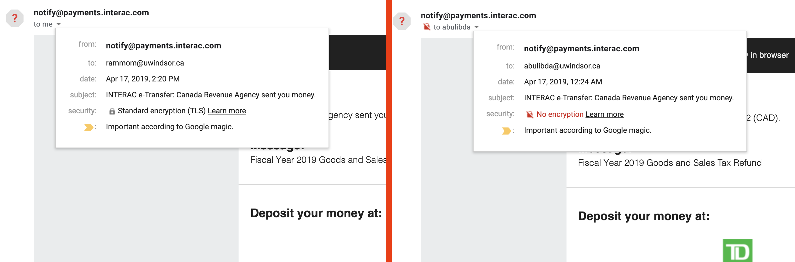
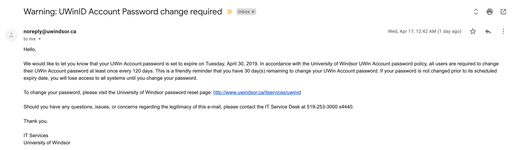
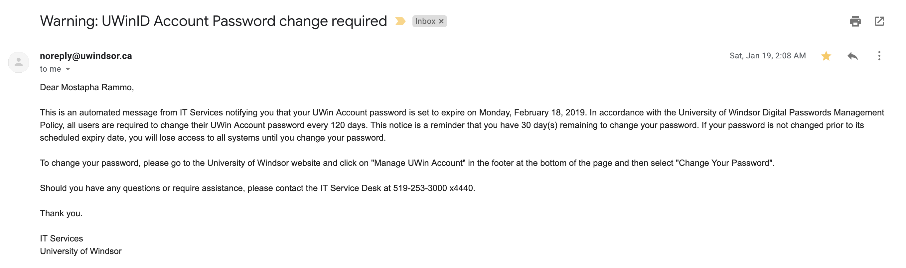

# Physher

Physher is a web application powered by Nodejs's Expressjs framework along side Facebook's react.  It is a demo project meant to exploit the dangers of phishing emails.  

In the process of building this demo for my COMP4670 Network Security class it was discovered that the University of Windsor's SMTP server is incredibly insecure. Using physher to send standard emails, it has been come to our attention that the server does not implement any sort of email authentication.  

We will cover some of the phishing techniques we've pursued in the following documentation, along with setup instructions so you can begin sending fake emails yourself

**Disclaimer: This product is used for demontration purposes only! Use of spoofed emails can be highly illegal.**

## Contents

  - [Dependencies](#Dependencies)
  - [Project Setup](#Setup)
  - [Project Results](#Results)

## Dependencies

Physher takes advantange of high level web frameworks to make email spoofing seamless:

* [node.js](https://nodejs.org/en/) - Javascript runtime to run javascript natively
* [Express](https://expressjs.com/) - Web framework built for node.js
* [React](https://reactjs.org/) - Javascript library for building user interfaces
* [reactstrap](https://reactstrap.github.io/) - CSS bootstrap library built for react
* [Nodemailer](https://nodemailer.com/about/) - node.js module to send out emails
* Many more dependencies can be found in each client and server project's `package.json` file

## Setup

Begin by installing [node.js](https://nodejs.org/en/) if you haven't already, then clone the project into a local directory on your machine

```sh
$ mkdir physher && cd ./physher
$ git clone https://github.com/rammom/Physher.git .
```

Start up the Express server
```sh
$ cd ./server
$ npm install && node app.js
```

Start up the React server
```sh
$ cd path/to/physher
$ cd ./client
$ npm install && npm start
```

Starting up the react server should directly open up a tab to the application, if not you can get to it at `http://localhost:3000`

## Results

As a result of this project, we are able to successfully send emails from any email address to an `@uwindsor.ca` email.  This is because, unlike it should, the University of Windsor does not validate any incoming email addresses.

The following are example emails being sent by Physher.

##### Interac E-Transfer



As you can see in the next image, the University of Windsor displays this email as though it were encrypted with standard TLS encryption when in reality it is not.  The image on the left is using UoW's SMTP server and the image on the right is Gmail's.

**Note: The second image is from an email sent to a uwindsor email that has my gmail account bcc'ed**



##### University of Windsor IT Services

The first image is a fake generated by Physher, where the second is a real email sent by UWindsor.






